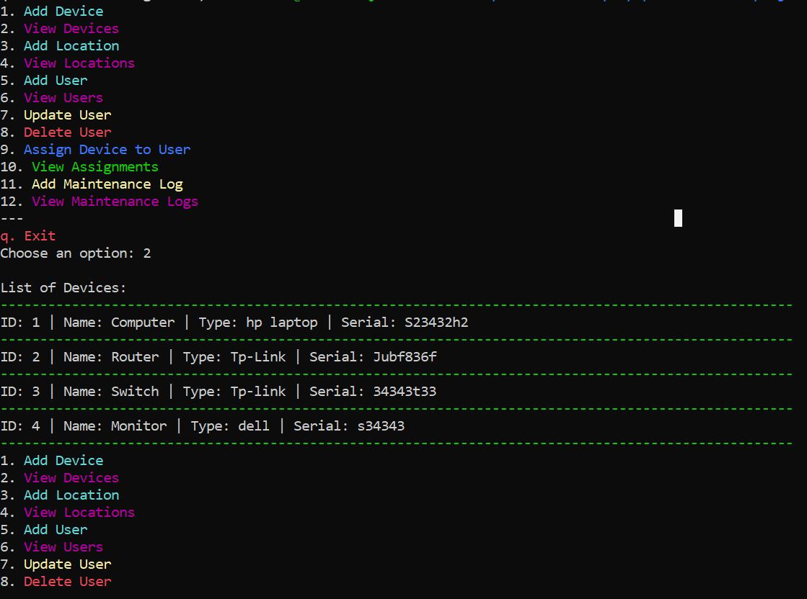

# ICT Resource Manager CLI


A command-line interface (CLI) application for managing ICT resources such as devices, locations, users, assignments, and maintenance logs within an institution.

This application was developed as a final project for the **Phase 3** Software Engineering module at **Moringa School**.

## Features

- **Device Management**: Add, view, update, or delete ICT devices.
- **Location Tracking**: Manage device locations (e.g., Labs, Offices).
- **User Management**: Register and manage staff and personnel using the resources.
- **Assignments**: Track which users are assigned which devices.
- **Maintenance Logs**: Record maintenance activities for each device.

## Technologies Used

- **Python 3.10**
- **SQLAlchemy** (ORM for database interaction)
- **Alembic** (for database migrations)
- **SQLite** (lightweight file-based database)
- **CLI Interface** using native Python input prompts
- **Pipenv** for dependency and virtual environment management

## Project Structure

```
ict-resource-manager-cli/
├── Pipfile                # Dependency definitions
├── Pipfile.lock           # Lock file for reproducible environments
├── README.md              # Project documentation
├── alembic.ini            # Alembic configuration file
├── app/
│   ├── __init__.py
│   ├── database.py        # DB connection and session setup
│   ├── main.py            # CLI entry point and logic
│   └── models/            # SQLAlchemy ORM models
│       ├── assignment.py
│       ├── device.py
│       ├── location.py
│       ├── maintenance_log.py
│       └── user.py
├── ict_resources.db       # SQLite database file (auto-generated)
└── migrations/            # Alembic migration files
```

## Setup Instructions

### 1. Clone the Repository

```bash
git clone https://github.com/your-username/ict-resource-manager-cli.git
cd ict-resource-manager-cli
```

### 2. Set Up a Virtual Environment

```bash
pipenv install
pipenv shell
```

### 3. Run Database Migrations

```bash
alembic upgrade head
```

### 4. Start the Application

```bash
python app/main.py or python3 -m app.main
```

## Alembic Migrations

To generate a new migration after model changes:

```bash
alembic revision --autogenerate -m "describe_your_change"
alembic upgrade head
```

## Screenshots (Optional)

_sample CLI interactions screenshots._

## Contributing

Pull requests are welcome! For major changes, please open an issue first to discuss what you would like to change.

## License

This project is licensed under the [MIT License](LICENSE).

---

> Developed by Isaac Mwiti Kubai under mentorship from **Moringa School**
